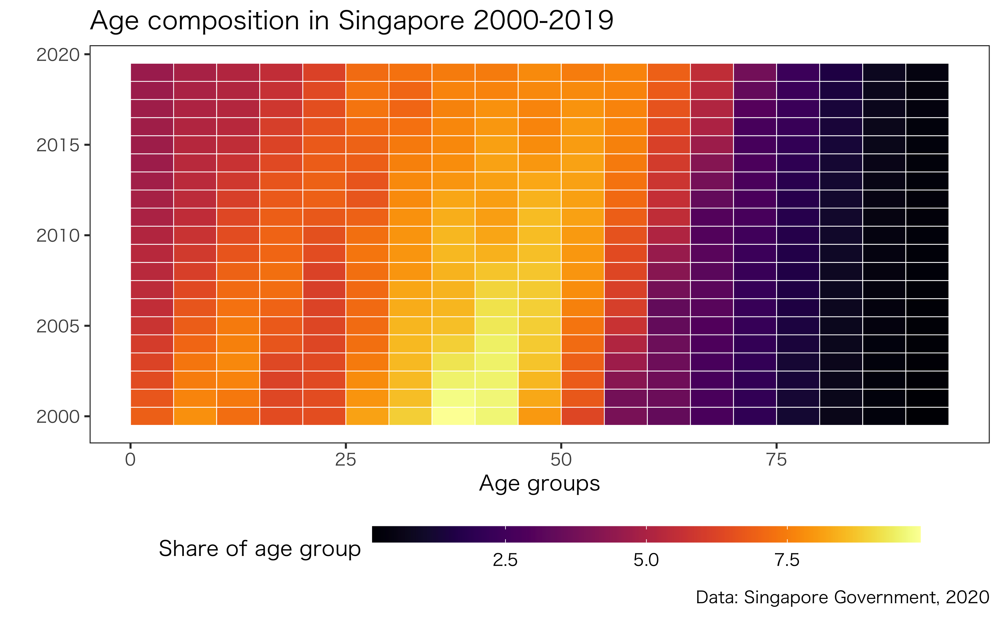

# Studio

This repo includes my work done for studio.
My aim was to analyze the influence of Minatomirai's waterfront development on the demography through simple visualization as a case study for our project in Singapore. 

Following contents are included:
1. Yokohama's demographic analysis
2. Singapore's demographic analysis

# 1. Yokohama's demographic analysis
  I visualized the changes in the population in the three districts near Minatomirai. You can see that population increased after 2000, when waterfront development started. 

  
  I also visualized age group composition in Yokohama and the three districts. You can see the population generally aging in Yokohama city.
  
  
  Compared to Yokohama as a whole, the surrounding districts have slightly more young-middle age group than Yokohama as a whole
  
  
  
  
# 2. Singapore's demographic analysis
  I visualized the changes in Singapore's population. You can see that the population is aging. 
  
  
  I also conducted social media analysis by scraping data from Flickr to see where people like to visit. I examined locations of photos with certain tags to find that people only visit CBD area for waterfront although Singapore is an island. The difference is clear when compared with a map of the 'Nature' tag. 
  
  
  
