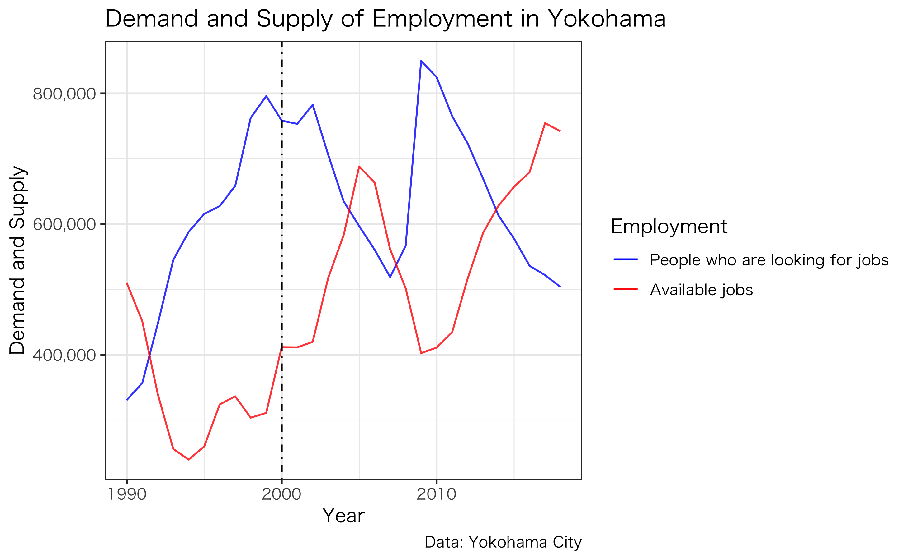

# Studio

This repo includes my work done for studio.
My aim was to analyze the influence of Minatomirai's waterfront development on the demography through simple visualization.

Following contents are included:
1. Yokohama's demographic analysis
2. Changes in tourists
3. Changes in employment

# 1. Yokohama's demographic analysis
  ## I visualized the changes in the population in the three districts near Minatomirai. You can see that population increased after 2000, when waterfront development started. 

  
  ## I also visualized age group composition in Yokohama and the three districts. You can see the population generally aging in Yokohama city.
  
  
  ## Compared to Yokohama as a whole, the surrounding districts have slightly more young-middle age group than Yokohama as a whole
  
  
  
  
# 2. Changes in tourists
 ## Tourists had been increasing even before the waterfront development, so it is not clear whether the development helped the tourism
 
 
# 3. Changes in employment
 ## After the development, more jobs became available.
 
  
